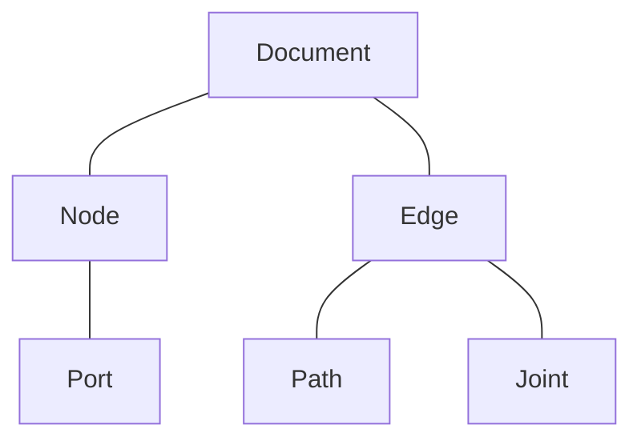

# Exploring Odoo
This repository contains source codes presented in youtube channel [Exploring Odoo](https://www.youtube.com/@exploring-odoo)

Please make sure you're on the correct branch.

# Nuido Branch
This branch is specific for Nuido related modules. `Nuido` is a library to create node based user interface for Odoo.

## Core Concept
Nuido's architecture is built around a set of core components and their associated models, providing the structure for creating diagrams and workflows. These components work together to manage visual representation, data, and connections within the application.

Visit the [documentation](https://exploring-odoo.pages.dev) for more details or if you're a visual learner, visit [Exploring Odoo Youtube Channel](https://www.youtube.com/@exploring-odoo).

If you find this useful, consider giving the repo a star ⭐️ — it helps keep the project visible and motivates continued work.

> [!NOTE]
> This branch requires you to be comfortable with Odoo frameworks such ash the ORM, OWL, Qweb, etc. You don't need to be an expert, but you still need to understand the basics.
>
> In other words, this branch is not for total beginners. Although the codes are still beginner friendly, i.e., no advanced techniques, the concepts presented in this branch can be overwhelming and confusing for a total beginner.

> [!CAUTION]
> Everything in this repo is purely experimental and for educational purpose use only.
>
> Do not use it in any environment but in an experimental one, definitely not in a production environment.
>
> I'm not responsible for any damage or harm by the use of anything from this repo.
>
> Use it at your own risk.
>

> [!IMPORTANT]
> This repository only serves as an archive, bugs will not be fixed.
>
> The only test performed was to make sure things can be run on my environment to create videos for channel Exploring Odoo, and only for the specific scenario of the related video.
>
> So, again, use it at your own risk.
>
> I do not provide support in any kind.

> [!TIP]
> It is important to watch the related video of the module thoroughly and read the video description too.
>
> The information about external libraries used and the links for those libraries are in there.
>
> E.g, if you're having trouble with the datalabel extension for chart.js then you must have not watched the video thoroughly. Please watch the video again thoroughly this time.
>

>[!WARNING]
> This repo and the youtube channel is to help you learn. Not to provide you with fully functional module.
>
> If you're having trouble with the code, ask politely and nicely like a civil person.
>

>[!CAUTION]
> _Please note that there are no upgrade/update paths for these modules._
>
> _Any updates will not consider the previous version, therefore if you want to use the updated version, you'll most likely need to uninstall the previous version first or install it on a new Odoo installation._
>

# Experimental Odoo Modules

| Name                             | Folder                                | Description                                                      |
| -------------------------------- | ------------------------------------- | ---------------------------------------------------------------- |
| AI Chat Base                     | ai_chat_base                          | This module provides the base to create streaming AI chat.       |
| Nuido                            | nuido                                 | Node based UI for Odoo                                           |
| Nuido Base                       | nuido_base                            | Base module to create Odoo app with node based UI                |
| Nuido Flow                       | nuido_flow                            | Base app for automation                                          |
| Nuido Flow AI                    | nuido_flow_ai                         | AI nodes for Nuido Flow.                                         |
| Nuido Flow AI Chat               | nuido_flow_ai_chat                    | AI chatbot nodes for Nuido Flow.                                 |
| Nuido Flow AI Mini Knowledge     | nuido_flow_ai_chat_mini_document      | Memory and tool for AI to utilize a basic knowledge base.        |
| Nuido Flow AI Website Chat       | nuido_flow_ai_chat_website_chat       | AI chatbot for websites.                                         |
| Nuido Flow Data                  | nuido_flow_data                       | Nuido Flow nodes for handling Odoo data.                         |
| Nuido Flow Messaging             | nuido_flow_messaging                  | Messaging addon for Nuido Flow                                   |
| Nuido Flow Trigger               | nuido_flow_trigger                    | Runs Nuido Flow with triggers.                                   |

# Contributing
As mentioned above, this repo is only for archiving purpose, i.e., for reference, to learn Odoo, or as proof of concepts.
Therefore, I'm not accepting PRs for this repo.

You are more than welcome to open discussion to share your thoughts, ideas, experiences or difficulties about modules in this repo.

And it'll be great if you can give a star and share this repo to others.
