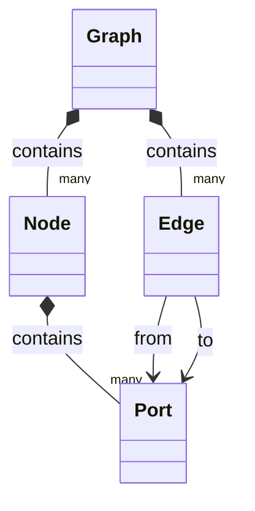
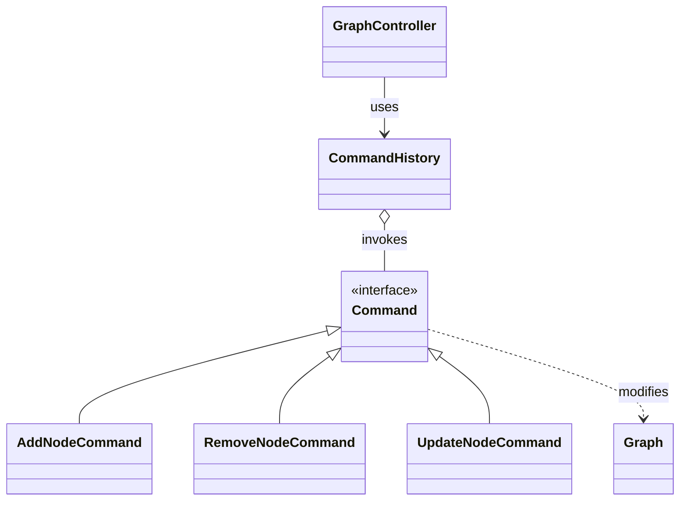

# 🚀 Exploring Odoo - N2 Branch

## Current State of N2 Development

The N2 project is currently under private development. You can read more about this decision [here](https://github.com/yonitjio/exploring-odoo/discussions/15).

### About N2
N2 is a personal, experimental project designed as a learning reference and guide. It’s not a commercial product—its main goal is to explore ideas and provide a resource for anyone curious to learn.

Development is private for now, and updates are shared exclusively through the [N2 website](https://n2.skysize.io).

To explore N2:
- Star this repository — your star helps keep the project visible.
- Sign in to the [N2 website](https://n2.skysize.io) with your GitHub account.

Once signed in, you can download N2 modules and I plan to put other modules there too. This project is meant as a learning reference, and your interest and participation are warmly appreciated.

---

### Note on availability
The [N2 website](https://n2.skysize.io) runs on a free-tier host, so availability depends on the provider’s policies. Registered users who have starred the repo can access the modules, so grab them while the site’s up and explore locally. Enjoy!

---

### 🧭 Roadmap

The roadmap below outlines current and planned improvements.

- [x] **Undo / Redo** — Add reversible actions for node editing and movement.
- [x] **New Node Styles** — New, more compact node styles to provide additional workspace.
- [x] **Keyboard Shortcuts** — Add keyboard shortcuts.
- [x] **Minimap** — Add an overview of the full workspace for easier navigation.
- [x] **Export / Import** — Enable saving and loading of node structures.
- [x] **Hints on Nodes** — Add tooltips or info buttons showing what each node does.
- [x] **Linked Node Properties** - New mechanism supports setting properties on connected auxiliary nodes.
- [X] **Automatic Layout** — Experiment with algorithms to automatically arrange nodes.
- [X] **Replicate Nuido Nodes to N2** — Implement nodes modeled after existing Nuido nodes.
  - [X] Core Nodes
  - [X] Trigger Nodes
  - [X] Data Nodes
  - [X] Messaging Nodes
- [ ] **New Nodes**.
  - [ ] Action Nodes
  - [ ] AI Nodes - Move on from Autogen. — TBD.

---

This repository contains the **source code** featured on the YouTube channel **[Exploring Odoo](https://www.youtube.com/@exploring-odoo)**.

**⚠️ IMPORTANT:** Make sure you are on the **correct branch** for the code you're seeking.

---

## ⚙️ About the N2 Branch
This branch is specifically dedicated to **N2-related modules**.

* **N2** is the continuation of `Nuido`, an original library that focused on creating node-based user interfaces for Odoo.
* **N2's current focus** is solely on **automation workflows**.

If you find this useful, consider giving the repo a **star ⭐️** — it helps keep the project visible and motivates continued work!

### Introduction Video

---
### Screenshots, Previews and Demo
#### Previews

N2 In Action (Animated Gif)

 

  

#### Dark Mode

Screenshot 001

 

  

##### Note on Dark Mode
The dark mode screenshots above use my custom theme based on the Solarized color palette. If your dark mode isn’t Solarized-based or you’d like to customize it, adjust the variables in variable.dark.scss to fit your preferred theme.

#### Light Mode

Screenshot 002

 

  

---

#### Demo
- Basic demo available at [N2 Website](https://n2.skysize.io/). The demo includes only basic nodes, as N2 depends on actual data to deliver meaningful functionality.
- The simulation is limited to generating a random graph traversal. It does not make any backend calls, and consequently no data is handled or processed.

---
### Core Concept
Nuido's architecture is built around a set of core components and their associated models, providing the structure for creating diagrams and workflows. These components work together to manage visual representation, data, and connections within the application.

While N2 utilizes a similar backend, the client-side implementation is entirely new. This overhaul is characterized primarily by the introduction of the Command design pattern and a shift to Composition, moving away from an inheritance-based architecture.

---

### 💡 Side-Effect Usage: A Visual Prototyping & Teaching Tool

Due to its node-based nature, where nodes can be viewed as individual functions with defined inputs and outputs, N2 can also be used as a visual prototyping environment for coding concepts.

Even though the project’s main goal is automation workflows, this structural similarity allows developers to experiment with logic flows, prototype algorithms, and visualize function interactions — essentially turning N2 into a lightweight, visual code sketchpad.

As a side effect, this makes N2 surprisingly effective as a teaching and learning tool.
Its visual approach helps illustrate programming logic, modular thinking, and data flow in a more intuitive way — perfectly aligning with the project’s broader vision of education, experimentation, and exploration within Odoo development.

---
## 🎯 Prerequisites & Target Audience

This branch is **NOT for total beginners**.

* You should be **comfortable** with core Odoo frameworks such as the **ORM, OWL, and QWeb**.
* While the code itself avoids advanced techniques, the **concepts** presented in this branch can be **overwhelming and confusing** for someone new to Odoo development.

---

## 📺 Essential Usage Tip

To properly use and understand this code, it is **absolutely essential** to watch the related video on the **[Exploring Odoo channel](https://www.youtube.com/@exploring-odoo)** *thoroughly*.

* **External Libraries:** Information about external libraries and their required links are provided in the **video description**.
* **Always check the video description and watch the video entirely** to avoid common setup issues (e.g., missing Chart.js extensions).

---

## 🚨 Critical Disclaimers & Limitations

Please read and understand these points before using the code.

### ⚠️ **Experimental and Educational Use ONLY** ⚠️

* **Do not use this code, repository, or any of its components in any live, production, mission-critical, or commercial environment.**
* This project is developed and maintained **solely for experimental, educational, and personal learning purposes.**
* While this code is **open-source** under the **MIT License**, and the license may technically allow commercial use, deploying it in a production setting is **strongly discouraged and counterproductive** to the project's goal.
* Its use in commercial settings would be entirely at your own risk. Moreover, the **pressure and demands** resulting from production usage may unfortunately force the maintainers to **stop or significantly slow down development**. Please respect the project's educational focus to ensure its continued evolution.
* I am **not responsible** for any damage or harm resulting from the use of anything from this repo. **Use it at your own risk.**

### 🐛 No Support

* This repository serves as an **archive** for the videos.
* Testing was minimal—only performed for the **specific scenario** of the related video.
* **I do not provide support in any kind.**
* The goal of this repo and the channel is to **help you learn**, not to provide you with a fully functional, production-ready module.

### 🧩 Bug Fixes & Feature Development

* **Bug fixes, enhancements, or new features will only be implemented when they align with planned or upcoming content** for the **[Exploring Odoo](https://www.youtube.com/@exploring-odoo)** YouTube channel.
* Development priorities are guided **exclusively** by the channel’s educational roadmap — **not by external requests or issue reports**.
* If you’d like to see certain features or topics explored, the best way to **influence future development** is by **⭐ starring this repository** and **📺 subscribing to the channel**.
  Both actions help signal community interest and directly motivate which areas receive attention in future videos.
* Requests and suggestions are always welcome for discussion, but **implementation is not guaranteed** unless they align with upcoming content.
* This ensures the project remains focused on its core purpose as a **teaching and exploration resource**, rather than evolving into a general-purpose or production-ready framework.

### ❌ No Upgrade Path

* **There are no upgrade/update paths for these modules.**
* If you want to use an updated version, you will most likely need to **uninstall the previous version first** or install it on a fresh Odoo instance.

---

## 🤝 Contributing

Since this repository is maintained purely for archiving and proof-of-concept purposes:

* **I am not accepting Pull Requests (PRs).**
* You are **more than welcome** to open a **discussion** to share your thoughts, ideas, experiences, or difficulties regarding the modules.
* The best way to contribute and support the project is by giving the repository a star ⭐️. It's a quick action that helps keep the project visible, validates the effort put into the videos, and motivates continued work on new content and modules.
* If you are having trouble with the code and wish to ask a question, please do so **politely and nicely**.

---

## 📄 Licensing of Modules

Most modules in this repository are licensed under the **MIT License**.
However, **not all modules share the same license**.

- The **`n2` module on the `N2` branch is MIT-licensed**.
- **Other modules related to N2 may use different licenses** and **are not MIT**.

To avoid confusion and ensure clarity:

> **Always check the `LICENSE` file inside each individual module directory** for the exact terms that apply to that module.

Each module’s license file is authoritative and may differ from others in this repository.

---

## 📌 Additional Usage Notes (Fork vs. Clone)

* **Cloning Recommended:** Since this repository is actively and frequently updated to match the latest YouTube content, a direct **`git clone`** is the recommended method for obtaining and working with the code.
* **Forking Not Recommended:** For most users, **forking is not recommended**. Forks create an independent copy that can quickly become outdated. Manually syncing your fork with this upstream repository would be more complicated than simply pulling changes to a direct clone.
* **Best Practice:** To ensure you always have the latest version of the code featured in the videos, use a direct clone and perform a regular `git pull`.